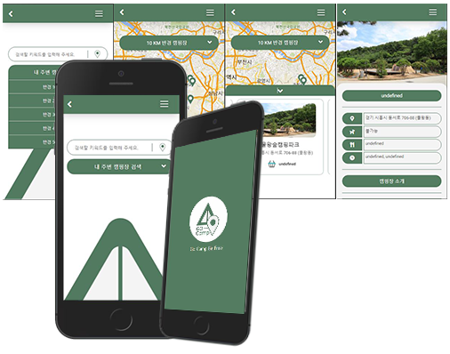

# API_Project - go camping

## Overview 😎

한국 관광공사의 고캠핑 API를 활용하여 만든 go camping입니다. 주변 캠핑장 검색 및 캠핑장 이름으로 캠핑장을 검색할 수 있는 기능을 적용하였으며 검색 결과에 따른 상세페이지를 구현하였습니다.  검색기능과 관련하여 API 제공 측에서 상세 데이터를 오픈하지 않은 상태라 검색시 캠핑장 이름 외 다른 데이터를 통한 검색 기능은 제공하고 있지 않습니다. 자세한 내용은 [issue](#issue) 부분을 확인해 주세요.

모바일 사이즈에 최적화 하여 제작하였기 때문에 모바일 사이즈로 확인해 주시기 바랍니다.

호스팅 링크 : [https://dabipyeung.com/APIProject/bumyeung/API_project/index.php](https://dabipyeung.com/APIProject/bumyeung/API_project/)

## Requirement

- HTML
- CSS
- Javascript
- [Jquery 3.6.0](https://code.jquery.com/)
- PHP

## Using API

- 한국관광공사 go camping API : [https://www.data.go.kr/data/15063201/openapi.do](https://www.data.go.kr/data/15063201/openapi.do)
- gelocation API
- google map API

## Plugin

- owl carousel

## Function

- 현재 위치 변경 일정 범위의 캠핑장 자동 검색(10 ~ 50km)
- 주요 캠핑장 키워드로 검색
- 검색 결과 지도에 마커로 표시
- 각 검색 결과 상세 페이지 표시 및 지도 표시

## <a id="issue">Issue</a>

- 오픈 데이터 수신 오류
- 지도 표시 멀티 타켓 마커 적용
- 상세 데이터 접근키 제공 안함
